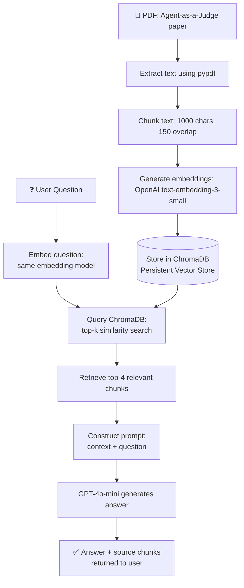

# Agent-as-a-Judge RAG Chatbot

A Retrieval-Augmented Generation (RAG) chatbot built on the paper "Agent-as-a-Judge: Evaluate Agents with Agents."

## Setup

1. `python3 -m venv venv && source venv/bin/activate`
2. `pip install openai pypdf chromadb python-dotenv --break-system-packages`
3. Create a `.env` file with `OPENAI_API_KEY=your-key-here`
4. Place the source PDF at `data/agent_as_a_judge.pdf`

## Usage

- Ingest the PDF into the vector store: `python src/ingest.py`
- Ask questions: `python src/query.py`

## Architecture

The diagram below shows the full RAG pipeline (also available in [workflow.md](./workflow.md)):

## Notes

During testing, one question (relating to a figure caption) returned an incomplete answer due to text-extraction artifacts common in multi-column PDF layouts near embedded diagrams. This was identified by manually cross-checking the retrieved chunks against the source PDF — the underlying evidence was present but corrupted mid-word by the extraction tool.