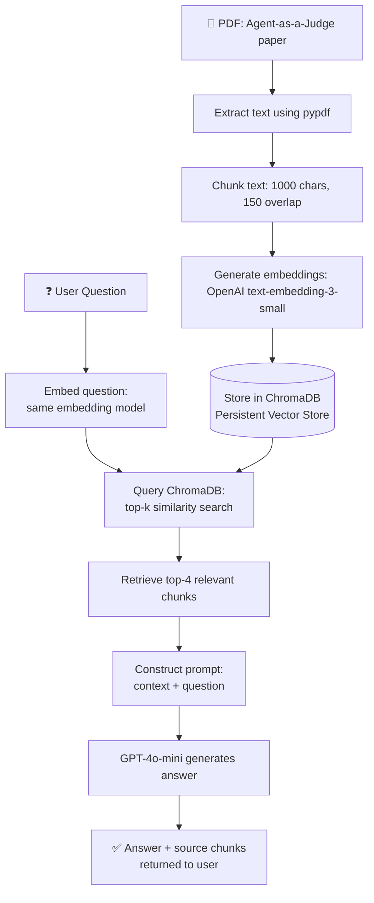

# RAG Workflow — Agent-as-a-Judge Chatbot

This document illustrates the end-to-end Retrieval-Augmented Generation (RAG) pipeline used in this project.

## Pipeline Diagram

## Stage-by-Stage Explanation

| Stage | Component | Description |
|---|---|---|
| 1 | **Ingestion** | `src/ingest.py` reads the PDF, extracts raw text using `pypdf` |
| 2 | **Chunking** | Text is split into 1000-character chunks with 150-character overlap to preserve context across boundaries |
| 3 | **Embedding** | Each chunk is converted into a vector using OpenAI's `text-embedding-3-small` model |
| 4 | **Storage** | Embeddings + original text are stored in a persistent ChromaDB collection |
| 5 | **Query** | `src/query.py` takes a user question, embeds it using the same model |
| 6 | **Retrieval** | ChromaDB performs similarity search, returning the top-4 most relevant chunks |
| 7 | **Generation** | Retrieved chunks + the question are passed to `gpt-4o-mini`, which generates a grounded answer |
| 8 | **Output** | The answer and its supporting chunks are both returned to the user for transparency and verification |

## Why This Design

- **Persistent vector store (ChromaDB)**: avoids re-embedding the PDF on every run
- **Chunk overlap**: prevents important context from being split awkwardly at chunk boundaries
- **Returning source chunks alongside answers**: allows manual verification of RAG output against the original document — critical for catching retrieval/generation errors (see README for a documented example)